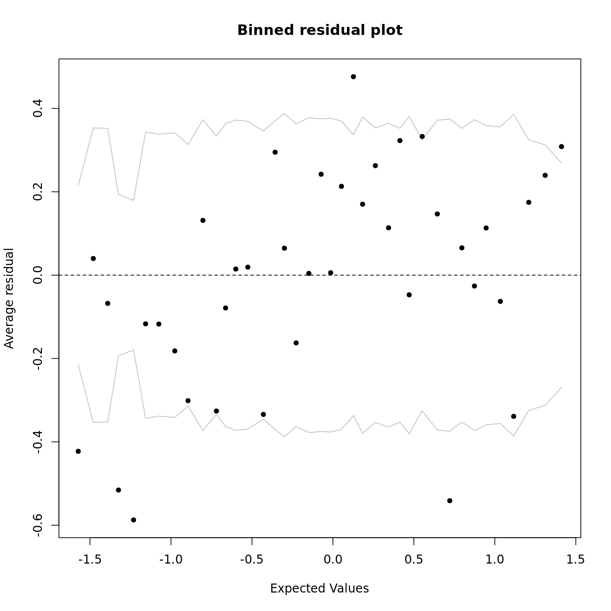
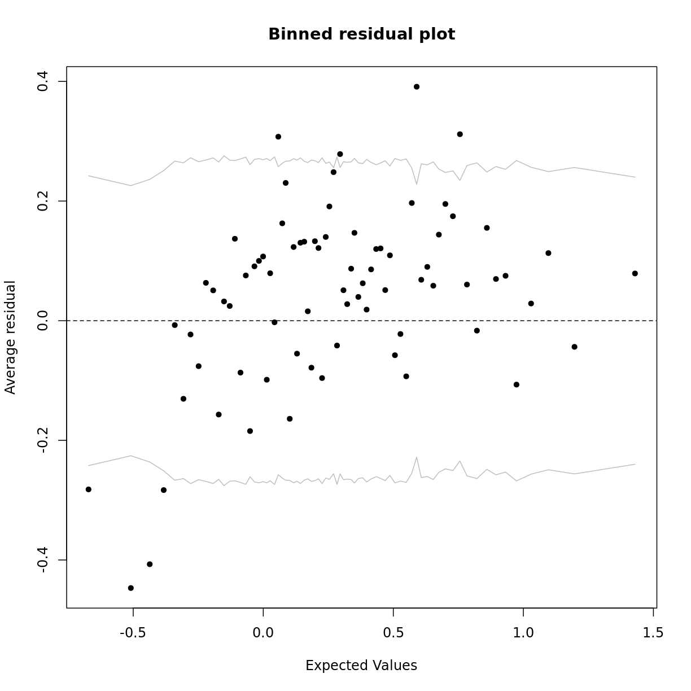

---
# Please do not edit this file directly; it is auto generated.
# Instead, please edit 05-assumpLogistic.md in _episodes_rmd/
source: Rmd
title: "Assessing logistic regression fit and assumptions"
objectives:
  - Calculate error rates as a measure of model fit.
  - Assess whether the assumptions of the logistic regression model have been violated. 
keypoints:
questions:
teaching: 10
execises: 10
---

In this episode we will check the fit and assumptions of logistic regression models. We will use error rates as a measure of model fit. We will also learn to assess the four logistic regression assumptions.

## Error rates as a measure of model fit

## Assessing model fit by plotting binned residuals

~~~
library(arm)
~~~
{: .language-r}

~~~
Loading required package: MASS
~~~
{: .output}

~~~

Attaching package: 'MASS'
~~~
{: .output}

~~~
The following object is masked from 'package:dplyr':

    select
~~~
{: .output}

~~~
Loading required package: Matrix
~~~
{: .output}

~~~

Attaching package: 'Matrix'
~~~
{: .output}

~~~
The following objects are masked from 'package:tidyr':

    expand, pack, unpack
~~~
{: .output}

~~~
Loading required package: lme4
~~~
{: .output}

~~~

arm (Version 1.11-2, built: 2020-7-27)
~~~
{: .output}

~~~
Working directory is /mnt/c/Users/elh605/demonstration/dataCarp/logistic-regression-public-health/_episodes_rmd
~~~
{: .output}

~~~
SmokeNow_Age <- dat %>%
  glm(formula = SmokeNow ~ AgeMonths,  family = "binomial")

binnedplot(x = predict(SmokeNow_Age),
           y = resid(SmokeNow_Age)) 
~~~
{: .language-r}

~~~
PhysActive_FEV1 <- dat %>%
 drop_na(PhysActive) %>%
 glm(formula = PhysActive ~ FEV1, family = "binomial")

binnedplot(x = predict(PhysActive_FEV1),
           y = resid(PhysActive_FEV1)) 
~~~
{: .language-r}

## Assessing the assumptions of the logistic regression model
The assumptions underlying the logistic regression model are similar to those
of the simple linear regression model. The key similarities and differences are:  
* Validity, representativeness and independent errors are assessed in the same way. See [this episode](https://carpentries-incubator.github.io/simple-linear-regression-public-health/06-fitAndAssumptionSLR/index.html) from the simple linear regression lesson for explanations and exercises for these assumptions.
* While logistic regression has the linearity and additivity assumption, it is slightly different. This assumption states that *the logit of* our outcome variable has a linear, additive relationship with the explanatory variables. Violations of the linearity assumption can sometimes be solved through transformation of explanatory variables. Violations of the additivity assumption can sometimes be solved through the inclusion of interactions.
* Homoscedasticity and normally distributed residuals are *not* assumptions underlying the logistic regression model.

